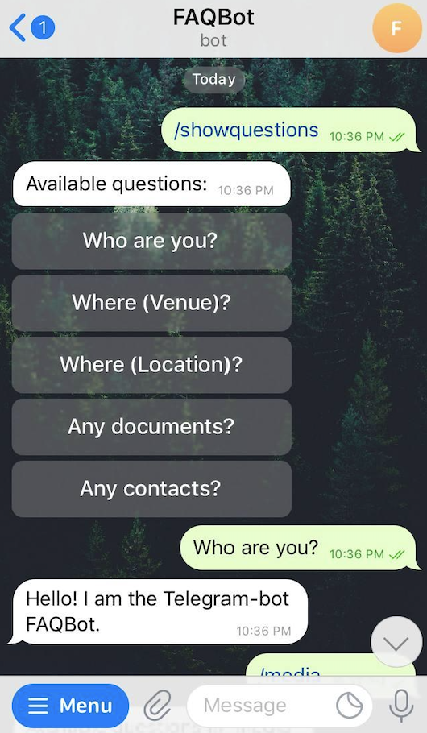

### FAQBot

The Telegrm-bot **FAQBot** quickly answers questions. 
Questions and answers to them are stored in the file `src/faq.json`.
The application uses the [Telegram-bot](https://github.com/TelegramBots) client.

#### faq.json scheme
```
[
  {
    "Category" : "Common",
    "Question": "Who are you?",
    "Answer": {
      "Text" : "Hello! I am the Telegram-bot FAQBot.",
      "Type" : 0
    }
  },
  {
    "Category" : "Navigation",
    "Question": "Where (Venue)?",
    "Answer": {
      "VenueData": {
        "Latitude" : 50.0840172,
        "Longitude" : 14.418288,
        "Address" : "Husova, 110 00 Staré Město, Czechia",
        "Title" : "Man Hanging out"
      },
      "Type" : 1
    }
  },
  {
    "Category" : "Navigation",
    "Question": "Where (Location)?",
    "Answer": {
      "LocationData": {
        "Latitude" : 33.747252,
        "Longitude" : -112.633853
      },
      "Type" : 2
    }
  },
  {
    "Category" : "Media",
    "Question": "Any documents?",
    "Answer": {
      "DocumentData" : {
        "DocumentUrl" : "https://github.com/TelegramBots/book/raw/master/src/docs/photo-ara.jpg",
        "Caption" : "Ara bird."
      },
      "Type" : 3
    }
  },
  {
    "Category" : "Usefully",
    "Question": "Any contacts?",
    "Answer": {
      "ContactData": {
      "FirstName" : "Xek",
      "LastName" : "Xekov",
      "PhoneNumber" : "+0987654321"
      },
      "Type" : 4
    }
  }
]
```

 The FAQ file contains array of objects. Each object has required fields: 

    - string Category,
    - string Question, 
    - object Answer
The content of the "Response" object depends on the type of message expressed as integer.

#### Message types
Specify the type of answer as a number.
```
0 - Text
1 - Venue
2 - Location
3 - Document
4 - Contact
```
Message Type Examples from [.NET Client](https://core.telegram.org/bots/api) for Telegram Bot API:
[Text](https://telegrambots.github.io/book/2/send-msg/text-msg.html),
[Venue](https://telegrambots.github.io/book/2/send-msg/other-msg.html),
[Location](https://telegrambots.github.io/book/2/send-msg/other-msg.html),
[Document](https://telegrambots.github.io/book/2/send-msg/document-animation-msg.html),
[Contact](https://telegrambots.github.io/book/2/send-msg/other-msg.html),

#### Commands
*/showquestions* - show all registered for the FAQbot questions.

*/hotreload* - reload questions and answers from the FAQ file without restarting the FAQbot. This is a service command
that is not displayed in the chat window. Hotreload from file can be done by any user
who knows this command.

*/'categoryName'* - show questions in groups. Groups are the categories 
assigned to the questions in the FAQ file.

